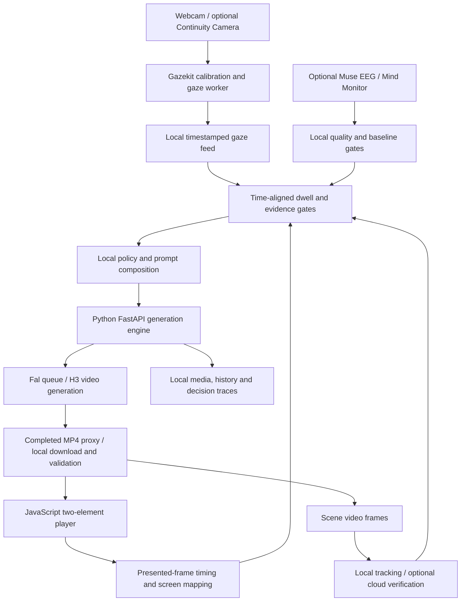

# GÖZ

**A gaze-adaptive generative video prototype: what you look at helps direct the next scene.**

GÖZ connects calibrated webcam gaze, scene tracking, a local adaptation controller and cloud video generation in a browser player. Instead of choosing a prerecorded branch, it changes the next generation prompt using a bounded window of attention evidence. An optional Muse EEG path explores physiological delivery cues; it remains experimental.

Built as a hackathon prototype, the project demonstrates the engineering around that loop: aligning gaze with presented video frames, rejecting stale evidence, recording the exact submitted prompt, handling asynchronous paid jobs, and continuing playback across generated clips. It is a local research/demo application, with release checks still outstanding.

## What it does

- **Adaptive story player:** observes the opening five seconds of a clip and can give an attended character the next clip's primary shot. Insufficient evidence keeps the continuation balanced.
- **Inspectable decisions:** a local decision trace links the source observation window, policy result, prompt difference and confirmed provider submission.
- **Ordered generation:** the separate sequence player generates saved clip bundles with fixed prompts, seeds and first/end frames, then stitches a downloadable MP4 with audio.
- **Explicit waiting and recovery:** two video elements preload and swap clips in order. Late generation holds the last frame with a visible bridge state; provider errors remain visible.
- **Free rehearsal:** synthetic video and simulated sensors exercise the downstream loop without an API key, camera, headset or paid generation.

A `focus_character` decision comes from local rules and appends a camera direction to the generation prompt. It does not establish that an LLM authored an adaptation, that the viewer enjoyed a character, or that the generated footage obeyed the direction.

## Architecture



The Python backend serves the plain JavaScript frontend and owns provider credentials, uploads, submissions, status polling, cancellation and media handling. No Node server or frontend build is required. Viewer camera imagery and raw EEG remain local; generation inputs and, when enabled, scene frames/reference crops go to the configured cloud services.

## Quick start: free rehearsal

Run these commands from the repository root using Python 3.11+:

```sh
python3 -m venv .venv
.venv/bin/python -m pip install -r requirements.txt
GOZ_DEMO=1 GOZ_GAZE=sim GOZ_EEG=sim GOZ_SIM_SEED=acceptance \
GOZ_SIM_FAVORITE=1 GOZ_SIM_BIAS=0.95 \
GOZ_DATA_DIR="$PWD/output/demo-data" PORT=3211 .venv/bin/python -m backend
```

Open [Adaptive Story](http://127.0.0.1:3211/adaptive.html) and start the story. The **DEMO / SIM** label identifies synthetic clips, targets and signals. `GOZ_SIM_FAVORITE=1` selects Patrick; `0` selects SpongeBob in the prefilled character order. This mode exercises analysis, policy, prompt composition and playback, including no paid identity-verification calls. It does not evaluate real gaze accuracy or generated storytelling quality.

The [sequence player](http://127.0.0.1:3211/) uses the same demo backend to generate synthetic MP4s from the ordered bundles. FFmpeg is supplied through `imageio-ffmpeg`.

## Live setup and configuration

### Requirements

| Mode | Requirements |
| --- | --- |
| Free rehearsal | Python 3.11+, a browser and disk space for local MP4s; no sensor hardware or local GPU required |
| Live video generation | Internet access, a configured Fal key and provider credit; generation runs remotely |
| Physical gaze | A separately installed Gazekit checkout, webcam, camera permission and viewer-specific calibration; the supported native camera workflow is macOS with Swift command line tools |
| Optional EEG | Muse 2 and Bluetooth permission for direct MuseLSL/Bleak, or Mind Monitor on a phone on the same Wi-Fi |
| Development checks | Node.js/npm for the JavaScript tests and TypeScript checks |

An iPhone with Continuity Camera is optional. No minimum RAM/CPU benchmark or cross-platform hardware certification is established here. Rehearse on the actual machine and display before presenting.

If `.env` is absent, copy the [example configuration](.env.example); preserve any existing configuration:

```sh
# Run only if you do not already have a .env file.
cp .env.example .env
```

Set `FAL_KEY` in `.env` for paid generation. The following is an example of a gaze-only live configuration; these values replace the corresponding entries in `.env`:

```dotenv
FAL_KEY=your-fal-key
PORT=3210
GOZ_DEMO=0
GOZ_GAZE=gazekit
GOZ_EEG=off
GOZ_REQUIRE_SENSORS=0
GOZ_TRACKER=color
GOZ_IDENTITY=off
GOZ_MAX_SCENES=4
GOZ_GAZE_PORT=5590
GOZ_VIEWER_PROFILE=default
# Set these to your separately installed Gazekit environment:
# GOZ_GAZEKIT_DIR=/absolute/path/to/gazekit
# GOZ_GAZEKIT_PYTHON=/absolute/path/to/gazekit/.venv/bin/python
# GOZ_DATA_DIR=/absolute/path/to/local-goz-data
```

GÖZ looks for Gazekit at `../gazekit` unless `GOZ_GAZEKIT_DIR` is set. Install its dependencies and models using the [Gazekit setup instructions](https://github.com/ba13231/gazekit). GÖZ owns the camera process; avoid a second stream using the same camera.

```sh
.venv/bin/python -m backend
```

Open [Adaptive Story](http://127.0.0.1:3210/adaptive.html). The macOS [Start GOZ.command](Start%20GOZ.command) launcher also creates an environment on first use and starts the backend. Restart the backend after changing `.env`.

**Generate, Regenerate and live adaptive starts submit paid requests when `GOZ_DEMO=0`.** Simulated sensors alone do not make generation free. Stop requests cancellation, but an accepted provider request may still finish and be charged.

### Gaze calibration and a live run

1. Choose the camera in the native selector and complete calibration. macOS capture uses the verified device UID rather than an OpenCV camera index. Legacy calibrations with unverified camera identity require full recalibration.
2. Use **Check gaze** with fresh targets while the session is stopped. **Recenter** applies an alignment correction only after independent checks pass. Recheck after changing seating; recalibrate for a different viewer, camera or display geometry.
3. Use the calibrated primary display at 100% browser zoom. Move the pointer diagonally across the player to anchor screen mapping after window movement, resizing or fullscreen changes. The gaze marker is measured, without snapping to target boxes.
4. Keep **Use the saved ordered prompts and frame pairs** selected for the bundled Secret Box sequence. For a custom story, deselect it and provide an opening frame or clip (up to 120 seconds / 100 MB). The bundled first frame is nearly black; an empty detection is expected there.
5. Start the story, enable sound and inspect the overlay and decision trace. Character emphasis needs shared visibility and sustained valid dwell; looking at a lone visible character does not establish comparative preference. Inspect both the submitted prompt and resulting video. Click the video if autoplay is blocked.

Calibration artifacts default to `data/calibration/`. `GOZ_VIEWER_PROFILE` separates saved viewer manifests; a verified calibration is saved atomically and failed attempts preserve the prior one. Loading a model successfully does not prove that it is accurate in the current setup. `GET /api/sensors` reports calibration state, camera identity and failure reasons.

### Tracking choices

`GOZ_TRACKER=color` selects the CPU-only [experimental color/shape detector](backend/adaptive/color_detector/README.md) for SpongeBob and Patrick. It uses color, body shape, eye/clothing support and bounded temporal association. Its boxes are **uncalibrated hypotheses**, not verified character identities. Scenery, clothing, small bodies, occlusion and changed appearances can cause false positives or missed detections. Unknown/ambiguous output is valid; it is not a general-purpose character recognizer.

`GOZ_TRACKER=fal` combines local tracking with bounded Florence dense-region captions on scene frames. Optional independent image-input identity checks use `GOZ_IDENTITY=auto`, `OPENAI_API_KEY` and an explicitly configured `GOZ_IDENTITY_MODEL` (or legacy `OPENAI_MODEL`). No identity model is silently selected when configuration is absent. Captions alone can misname characters; cloud verification can fail, time out or arrive after the decision window. `.env.example` currently selects the Fal route, so explicitly set the desired tracker for a reproducible run.

### Optional EEG

Set `GOZ_EEG=muse` for the owned MuseLSL/Bleak bridge, or `GOZ_EEG=mindmonitor` for OSC from Mind Monitor to the Mac's IP on UDP port `5000` (`GOZ_MINDMONITOR_PORT`). Mind Monitor must send contact quality (`horseshoe`), `alpha_absolute` and `beta_absolute`; blink/jaw-clench and raw EEG improve artifact rejection. If the iPhone is also the camera, use another device for Mind Monitor.

Direct Muse requires a genuine 60-clean-second baseline and fresh usable samples. Close other apps connected to the headset before direct discovery. `GOZ_REQUIRE_SENSORS=0` permits gaze-only use when EEG is absent or noisy; `1` requires both sensors for a strict rehearsal gate.

The experimental EEG policies compare eligible physiological changes against a baseline or prior played clips and can add delivery cues when their gates pass. They are engineering heuristics, not validated emotion, enjoyment or focus probabilities. Missing or artifact-contaminated EEG contributes no cue. **EEG was not verified to drive adaptation in the live runs summarized below.**

## Demo and verified evidence

**A public demo recording is still missing.** No shareable walkthrough video or hosted demo link has been verified for this README. The free rehearsal above is reproducible; private ignored media and sensor logs are not a public demo asset.

Local decision-journal records and playback events from October 4, 2026 confirm:

| Physical-gaze session | Confirmed submitted prompt changes |
| --- | --- |
| Earlier run (`ac2920b9…`, 11:02 UTC) | One of four submitted prompts added a Patrick primary-shot direction; this run used the earlier 3.5-second observation window |
| Latest run (`a8cc7deb…`, 18:30 UTC) | Two of four submitted prompts added a SpongeBob primary-shot direction after five-second observation windows |

Both runs used experimental color tracking. The journal records confirmed submissions and completed generations; playback events record four clips playing in each run. EEG cues were not applied. This verifies the gaze → local decision → changed provider prompt → generated clip → playback path, subject to the tracker limitations. It does not establish causal improvement in the video, reliable character recognition or story fidelity. Earlier inspected comparison footage violated the requested closed-box outcome despite the direction.

Only aggregate outcomes are included here. The supporting `data/adaptive/decision-traces.jsonl` and per-session `events.jsonl` are private, ignored local artifacts and will not exist in a fresh clone.

## Playback, latency and recovery

The default adaptive delivery waits for the downloaded MP4 to pass local validation. **Stream completed videos while downloading** optionally starts same-origin range playback after Fal has finished and the MP4 passes the early metadata/range gate. The local copy continues downloading for validation, tracking and continuation-frame extraction. This is streaming a completed result, not unfinished model rendering. If the early stream probe fails, playback uses the validated download.

Tracking and local preparation may lag playback. The five-second observation deadline is not extended to wait for them; unavailable, stale or insufficient evidence keeps the request balanced. Gaze dwell uses valid elapsed intervals, excludes pauses, seeks, face loss and mismatched/stale clips, and never treats missing tracking as looking away. A submitted request is immutable; later observations affect later requests.

The player buffers one future continuation. If it is late, **BRIDGE · holding the last frame** marks downtime and collects no new playback evidence. A finite queue cannot guarantee continuous playback when generation is slower than consumption. Custom continuations use the actual final decoded frame; saved bundles retain their prescribed boundary frames.

The sequence player at `/` loads 12 bundled 15-second clip definitions from [presets/secret-box](presets/secret-box/). Generate and Regenerate preserve saved inputs and seeds; stitching sorts by order, preserves audio and produces `final_video.mp4`. Generation times distinguish local work, client-observed queue/provider time, download/validation and provider metrics when available. These scopes can overlap and are not an end-to-end speed benchmark.

Run one backend process per data directory. It binds to localhost and rejects foreign hosts/origins. Local `data/` includes media, prompts, request IDs, timings, references, calibration and sensor evidence; `.env`, `data/` and `output/` are ignored by Git. Provider media URLs can expire, so retain needed downloads.

Browser reload reconnects to the current in-memory session, but does not restore an exact mid-clip position. Backend restart preserves stored data and can monitor known requests, but does not resume adaptive generation. Paid submissions are not blindly retried. An uncertain request blocks further generation: inspect provider history before resolving local state with the server stopped.

## Code map and development checks

| Path | Responsibility |
| --- | --- |
| [backend/app.py](backend/app.py), [backend/adaptive/routes.py](backend/adaptive/routes.py) | FastAPI routes, frontend serving and sensor/session lifecycle |
| [backend/adaptive/session.py](backend/adaptive/session.py) | Observation freeze, generation ownership, tracking and readiness |
| [backend/adaptive/fusion.py](backend/adaptive/fusion.py), [profile.py](backend/adaptive/profile.py), [director.py](backend/adaptive/director.py) | Time-aligned evidence, tentative attention profile and prompt composition |
| [backend/adaptive/decision_trace.py](backend/adaptive/decision_trace.py) | Inspectable submission and prompt-difference journal |
| [backend/sensor_setup.py](backend/sensor_setup.py), [gaze_worker.py](backend/gaze_worker.py) | Calibration persistence, checks and Gazekit process ownership |
| [backend/adaptive/sensors.py](backend/adaptive/sensors.py), [mindmonitor.py](backend/adaptive/mindmonitor.py) | Local gaze/EEG feeds and quality handling |
| [backend/engine.py](backend/engine.py), [fal_adapter.py](backend/fal_adapter.py) | Provider jobs, persistence and recovery |
| [backend/frames.py](backend/frames.py), [progressive_media.py](backend/progressive_media.py), [bundle_sequence.py](backend/bundle_sequence.py) | Media validation, completed-video streaming and ordered assembly |
| [frontend/](frontend/) | Plain JavaScript player, overlays, queue and decision dashboard |
| [tests/](tests/), [docs/](docs/) | Regression tests and technical investigation notes |

```sh
.venv/bin/python -m pip install -r requirements-dev.txt
.venv/bin/python -m pytest -q
npm ci
npm run typecheck
npm run check
npm test
git diff --check
```

The suites cover deterministic replay, evidence gates, prompt/payload differences, calibration serialization, sensor quality, queue ordering, cancellation, malformed results and recovery. They do not substitute for fresh hardware or live-provider acceptance. There is no frontend build or separate lint script. For API inspection, FastAPI's local [interactive docs](http://127.0.0.1:3210/docs) expose the registered routes.

## Limitations and release readiness

This prototype has no established gaze-accuracy benchmark across viewers, EEG efficacy validation, general character-recognition guarantee or continuous-generation throughput guarantee. Provider output can ignore framing, dialogue and story constraints. Multi-display/changed browser zoom and physical setup changes need further validation. Hardware support and installation reproducibility beyond the demonstrated macOS workflow remain owner checks.

Before a public release, the owner still needs to:

- Record and review a shareable demo using cleared assets, showing the observation, decision, changed prompt and resulting playback.
- Test installation from a fresh clone and run the current regression checks; document supported Python, Node and hardware versions.
- Review the full repository and Git history for credentials, private sensor/calibration material and generated media. Ignore rules alone do not establish a clean history.
- Choose a project license and review dependency obligations, upstream code/model terms and rights to bundled characters, prompts, frames and generated footage. Existing separate third-party notices, including [the bundled Ultralytics notice](backend/adaptive/yoloe_detector/ULTRALYTICS-LICENSE.txt), remain applicable to their components and do not license the whole project.
- Define retention/consent practices for local viewer data and complete security, privacy and dependency review before broader distribution.

These are outstanding release checks; this README update does not certify secrets/history, legal or security audits.
